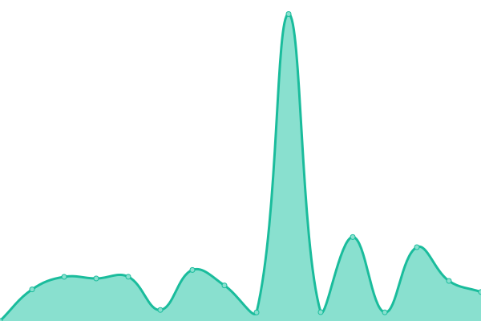

# [📈 Live Status](https://cloudzap.onezcloud.uk): <!--live status--> **🟧 Partial outage**

This repository contains the open-source uptime monitor and status page for [CloudZap](https://cloudzap.onezcloud.uk), powered by [Upptime](https://github.com/upptime/upptime).

With [Upptime](https://upptime.js.org), you can get your own unlimited and free uptime monitor and status page, powered entirely by a GitHub repository. We use [Issues](https://github.com/ZapYo-Ltd/CloudZap/issues) as incident reports, [Actions](https://github.com/ZapYo-Ltd/CloudZap/actions) as uptime monitors, and [Pages](https://cloudzap.onezcloud.uk) for the status page.

<!--start: status pages-->
<!-- This summary is generated by Upptime (https://github.com/upptime/upptime) -->
<!-- Do not edit this manually, your changes will be overwritten -->
<!-- prettier-ignore -->
| URL | Status | History | Response Time | Uptime |
| --- | ------ | ------- | ------------- | ------ |
|  [WillsWay Ltd](https://willsway.uk) | 🟥 Down | [wills-way-ltd.yml](https://github.com/WillsWay-Ltd/WillsWay-Webcare-Site-Monitor/commits/HEAD/history/wills-way-ltd.yml) | 

 1142ms
     
 | 

<a href="https://status.willsway.uk/history/wills-way-ltd">100.00%</a>
    

|  [WillsWebcare (Web Monitor)](https://status.willsway.uk) | 🟩 Up | [wills-webcare-web-monitor.yml](https://github.com/WillsWay-Ltd/WillsWay-Webcare-Site-Monitor/commits/HEAD/history/wills-webcare-web-monitor.yml) | 

 270ms
     
 | 

<a href="https://status.willsway.uk/history/wills-webcare-web-monitor">100.00%</a>
    

|  [Ibraheem Dulmeer](https://www.ibraheemdulmeer.com) | 🟩 Up | [ibraheem-dulmeer.yml](https://github.com/WillsWay-Ltd/WillsWay-Webcare-Site-Monitor/commits/HEAD/history/ibraheem-dulmeer.yml) | 

 1729ms
     
 | 

<a href="https://status.willsway.uk/history/ibraheem-dulmeer">92.38%</a>
    

|  [Park Homes Law](https://parkhomeslaw.com) | 🟥 Down | [park-homes-law.yml](https://github.com/WillsWay-Ltd/WillsWay-Webcare-Site-Monitor/commits/HEAD/history/park-homes-law.yml) | 

 1074ms
     
 | 

<a href="https://status.willsway.uk/history/park-homes-law">100.00%</a>
    

|  [Holiday Park Law](https://www.holidayparklaw.com) | 🟩 Up | [holiday-park-law.yml](https://github.com/WillsWay-Ltd/WillsWay-Webcare-Site-Monitor/commits/HEAD/history/holiday-park-law.yml) | 

 599ms
     
 | 

<a href="https://status.willsway.uk/history/holiday-park-law">100.00%</a>
    

|  [Lease Barristers](https://leasebarristers.com) | 🟩 Up | [lease-barristers.yml](https://github.com/WillsWay-Ltd/WillsWay-Webcare-Site-Monitor/commits/HEAD/history/lease-barristers.yml) | 

 5795ms
     
 | 

<a href="https://status.willsway.uk/history/lease-barristers">93.46%</a>
    

|  [Rent Repayment Law](https://rentrepaymentlaw.com) | 🟩 Up | [rent-repayment-law.yml](https://github.com/WillsWay-Ltd/WillsWay-Webcare-Site-Monitor/commits/HEAD/history/rent-repayment-law.yml) | 

 3935ms
     
 | 

<a href="https://status.willsway.uk/history/rent-repayment-law">94.19%</a>
    

|  [Will Young](https://willyoung.uk) | 🟥 Down | [will-young.yml](https://github.com/WillsWay-Ltd/WillsWay-Webcare-Site-Monitor/commits/HEAD/history/will-young.yml) | 

 533ms
     
 | 

<a href="https://status.willsway.uk/history/will-young">100.00%</a>
    

|  [The Angel Inn](https://theangelinn.uk) | 🟥 Down | [the-angel-inn.yml](https://github.com/WillsWay-Ltd/WillsWay-Webcare-Site-Monitor/commits/HEAD/history/the-angel-inn.yml) | 

 1196ms
     
 | 

<a href="https://status.willsway.uk/history/the-angel-inn">100.00%</a>
    

<!--end: status pages-->

[**Visit our status website →**](https://cloudzap.onezcloud.uk)

## 📄 License

- Powered by: [Upptime](https://github.com/upptime/upptime)
- Code: [MIT](./LICENSE) © [Anand Chowdhary](https://anandchowdhary.com), supported by [Pabio](https://pabio.com)
- Data in the `./history` directory: [Open Database License](https://opendatacommons.org/licenses/odbl/1-0/)
